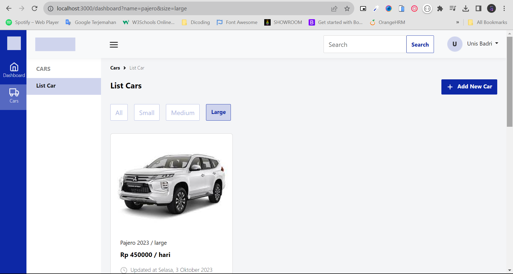
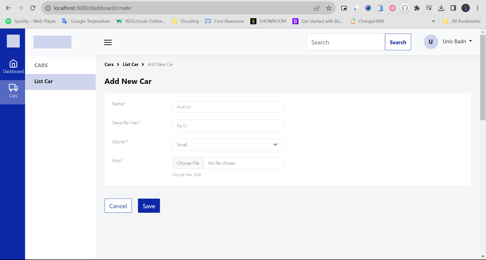
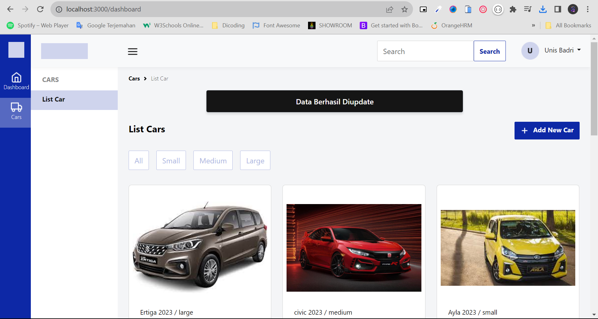
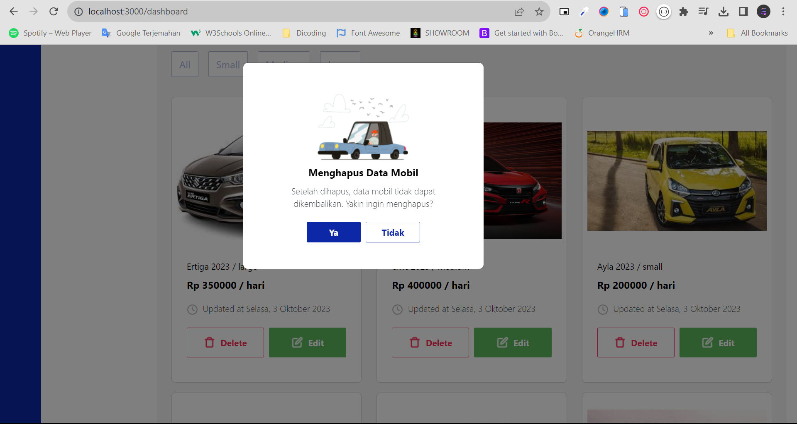
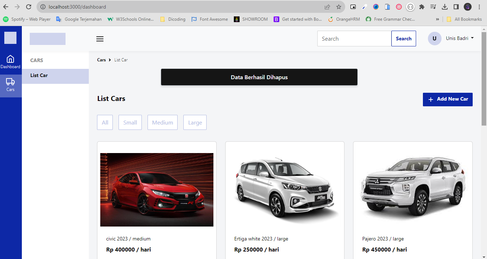
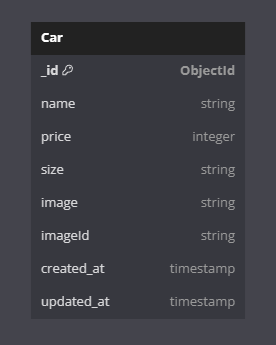

# Challenge 4

## Installations

Before you start, make sure you have downloaded NPM (Node Package Manager), NodeJS at least version 16 and register website cloudinary

#### Clone Repository

```shell
git clone https://github.com/syifasukmaa/CH4-Cars_Dashboard.git
cd CH4-Cars_Dashboard
```

#### Install Depedencies

```shell
npm install
```

#### Set up Environment

```shell
DATABASE_URI= your_link_database
CLOUD_NAME = your_name_cloudinary
CLOUD_API_KEY = your_api_key_cloudinary
CLOUD_API_SECRET = your_api_secret_cloudinary
```

## Usage

### Start Development Server

```shell
npm run dev
http://localhost:3000/dashboard
```

#### Dashboard Car Page



#### Create Car Page



#### Create Car Notification


#### Update Car Page


#### Update Car Notification



#### Delete Car Modal



#### Delete Car Notification



### ERD


