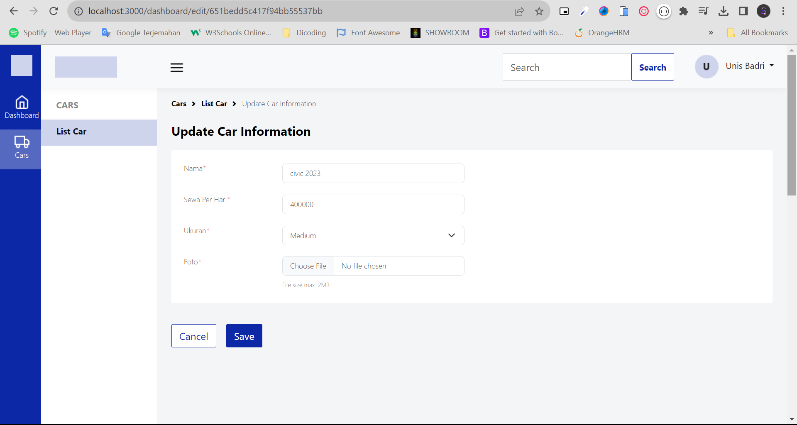

# Challenge 4

## Installations

Before you start, make sure you have downloaded NPM (Node Package Manager), NodeJS at least version 16 and register website cloudinary

#### Clone Repository

```shell
git clone https://github.com/syifasukmaa/CH4-Cars_Dashboard.git
cd CH4-Cars_Dashboard
```

#### Install Depedencies

```shell
npm install
```

#### Set up Environment

```shell
DATABASE_URI= your_link_database
CLOUD_NAME = your_name_cloudinary
CLOUD_API_KEY = your_api_key_cloudinary
CLOUD_API_SECRET = your_api_secret_cloudinary
```

## Usage

### Start Development Server

```shell
npm run dev
http://localhost:3000/dashboard
```

#### Dashboard Car Page

```shell
/dashboard
```


#### Create Car Page

```shell
/dashboard/create
```


#### Create Car Notification


#### Update Car Page

```shell
dashboard/update/:id
```



#### Update Car Notification


#### Delete Car Modal


#### Delete Car Notification


## REST API

The REST API to the example app is described below.

### Get All Cars

##### Request:

`GET /api/v1/cars`

##### Response:

```shell
{
    "status": "success",
    "message": "Success Get All Cars",
    "length": 1,
    "data": {
        "cars": [
            {
                "_id": "651e1829c2d99956e3fb9e73",
                "name": "Ayla 2023",
                "price": 100000,
                "size": "small",
                "image": "https://res.cloudinary.com/day8xqvrf/image/upload/v1696470964/mczkwidtswbbbv560og1.jpg",
                "imageId": "mczkwidtswbbbv560og1",
                "createdAt": "2023-10-05T01:58:01.027Z",
                "updatedAt": "2023-10-05T01:58:01.027Z",
                "__v": 0
            },
        ]
    }
}
```

### Get one Car

##### Request:

`GET /api/v1/cars/:id`

##### Response:

```
{
    "status": "success",
    "message": "Success Get Car Detail",
    "data": {
        "_id": "651e18d9c2d99956e3fb9e8a",
        "name": "Ertiga 2023",
        "price": 200000,
        "size": "large",
        "image": "https://res.cloudinary.com/day8xqvrf/image/upload/v1696471141/jyiqpoq4fuxx6y2ztogd.jpg",
        "imageId": "jyiqpoq4fuxx6y2ztogd",
        "createdAt": "2023-10-05T02:00:57.999Z",
        "updatedAt": "2023-10-05T02:00:57.999Z",
        "__v": 0
    }
}
```

### Create a new Car

##### Request:

`POST /api/v1/cars`

##### Response:

```shell
{
    "status": "success",
    "message": "Success create new car",
    "data": {
        "car": {
            "name": "Brio",
            "price": 100000,
            "size": "small",
            "image": "https://res.cloudinary.com/day8xqvrf/image/upload/v1696655281/z9zrlb0gc4t5fmxr3msi.png",
            "imageId": "z9zrlb0gc4t5fmxr3msi",
            "_id": "6520e827ac6f1264e4e19d6c",
            "createdAt": "2023-10-07T05:09:59.414Z",
            "updatedAt": "2023-10-07T05:09:59.414Z",
            "__v": 0
        }
    }
}
```

### Update Car

##### Request:

`PATCH /api/v1/cars/:id`

##### Response:

```shell
{
    "status": "success",
    "message": "Success update car",
    "data": {
        "car": {
            "_id": "6520e827ac6f1264e4e19d6c",
            "name": "Brio 2023 Terbaru",
            "price": 100000,
            "size": "small",
            "image": "https://res.cloudinary.com/day8xqvrf/image/upload/v1696657143/pbzukvsh4xmuwfd451ki.jpg",
            "imageId": "hnujym0vvxi2ylmagbjc",
            "createdAt": "2023-10-07T05:09:59.414Z",
            "updatedAt": "2023-10-07T05:41:02.530Z",
            "__v": 0
        }
    }
}
```

### Delete Car

##### Request:

`DELETE /api/v1/cars/:id`

##### Response:

```shell
{
    "status": "success",
    "message": "Success delete car",
    "data": null
}
```

### ERD


